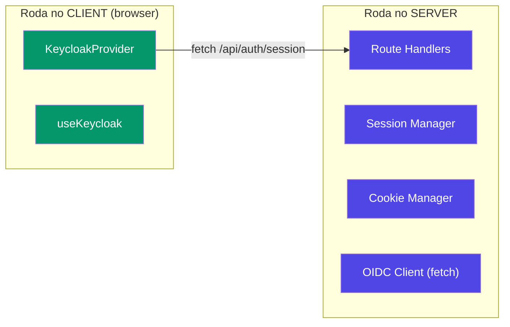

# Relatório: Como criar uma lib React para Next.js

## 1. Base React utilizada nesta lib

### React 19 + App Router (Server/Client model)

A lib foi construída para o **React 19** (peer dep `>=19`) rodando no **Next.js 16** com App Router. Isso define duas decisões fundamentais:

| Conceito | O que significa para a lib |
|----------|---------------------------|
| **Server Components** (padrão) | Componentes no Next.js 16 são server-side por padrão. A lib precisa marcar explicitamente o que roda no client com `"use client"` |
| **Client Components** | `KeycloakProvider` e `useKeycloak` precisam do `"use client"` porque usam `useState`, `useEffect`, `useContext` — hooks que só existem no browser |
| **Route Handlers** | Substituem as antigas API Routes do Pages Router. A lib exporta handlers (`GET`) compatíveis com o padrão `NextRequest → NextResponse` |

### Hooks utilizados da base React

```
useState     → Estado local (authenticated, user, loading, token)
useEffect    → Buscar sessão ao montar + polling periódico
useContext   → Consumir o KeycloakContext no hook useKeycloak
useCallback  → Memoizar funções (login, logout, hasRole) para evitar re-renders
useMemo      → Memoizar o objeto de contexto inteiro
createContext → Criar o canal de comunicação Provider → Consumer
```

> [!NOTE]
> Não usamos `useReducer` porque o estado é simples (poucas variáveis independentes). Para libs com estado mais complexo (muitas transições), `useReducer` seria melhor.

---

## 2. Pontos críticos ao criar uma lib React para Next.js

### 2.1 — `"use client"` directive

Este é o ponto **mais importante**. No App Router, todo módulo é server por padrão. Se a sua lib usa qualquer hook React (`useState`, `useEffect`, etc.) ou APIs do browser (`window`, `document`), você **deve** adicionar `"use client"` no topo do arquivo.

```tsx
// ✅ Correto — funciona no Next.js App Router
'use client';
import { useState } from 'react';
export function MyComponent() { ... }
```

```tsx
// ❌ Errado — vai quebrar, porque useState não existe no server
import { useState } from 'react';
export function MyComponent() { ... }
```

**Estratégia usada na lib**: Marcamos o `"use client"` diretamente nos arquivos de componente (`KeycloakProvider.tsx`, `useKeycloak.ts`). Além disso, o tsup adiciona `"use client"` como banner no bundle final.

### 2.2 — Peer Dependencies vs Dependencies

```json
// ✅ Correto
"peerDependencies": {
  "react": ">=19.0.0",      // O PROJETO do dev fornece o React
  "react-dom": ">=19.0.0",
  "next": ">=16.0.0"
}

// ❌ Errado — causaria duas instâncias do React
"dependencies": {
  "react": "^19.0.0"  // NUNCA faça isso em uma lib
}
```

| Tipo | Quando usar |
|------|-------------|
| `peerDependencies` | React, ReactDOM, Next.js — o projeto consumidor já tem instalado |
| `dependencies` | Libs que a sua lib precisa e que o consumidor NÃO tem (ex: `jose`) |
| `devDependencies` | Ferramentas de build (tsup, typescript, @types/*) |

> [!CAUTION]
> Se você colocar `react` como `dependency` (não peer), o npm pode instalar **duas cópias do React**, o que quebra hooks e Context completamente. O React foi feito para ter uma ÚNICA instância no bundle.

### 2.3 — Bundler: por que tsup?

| Bundler | Prós | Contras |
|---------|------|---------|
| **tsup** (usado) | Zero-config, rápido (esbuild), gera CJS+ESM+.d.ts | Menos pluggable que Rollup |
| Rollup | Controle granular, ecosystem de plugins | Configuração mais complexa |
| tsc (puro) | Zero dependência | Não faz bundle, não minifica, não gera ESM/CJS dual |

A config chave no `tsup.config.ts`:

```ts
{
  entry: ['src/index.ts'],    // Um único entry point
  format: ['cjs', 'esm'],     // Dual format para compatibilidade máxima
  dts: true,                   // Gera arquivos .d.ts
  external: ['react', 'react-dom', 'next'],  // NÃO incluir no bundle
  banner: { js: "'use client';" },           // Directive para Next.js
}
```

### 2.4 — `exports` field no package.json

O campo `exports` é essencial para que o Next.js resolva corretamente o import:

```json
"exports": {
  ".": {
    "import": {                    // Quando o dev faz: import { ... } from '...'
      "types": "./dist/index.d.mts",
      "default": "./dist/index.mjs"
    },
    "require": {                   // Quando o dev faz: require('...')
      "types": "./dist/index.d.ts",
      "default": "./dist/index.js"
    }
  }
}
```

> [!IMPORTANT]
> **Ordem importa**: `types` deve vir ANTES de `default` dentro de cada condição. O TypeScript resolve do topo para baixo.

### 2.5 — Separação Server vs Client no código da lib



A regra é simples:
- **Server**: `cookies()` do `next/headers`, `NextRequest`/`NextResponse`, `fetch` para APIs externas
- **Client**: `useState`, `useEffect`, `window.location`, `fetch` interno para `/api/auth/*`

### 2.6 — Cookies no Next.js 16 (App Router)

```ts
// Server-side — usar a API assíncrona do Next.js
import { cookies } from 'next/headers';
const cookieStore = await cookies();  // ← await obrigatório no Next.js 16
cookieStore.set('name', 'value', { httpOnly: true, secure: true });
```

No Next.js 16, `cookies()` retorna uma **Promise** (mudança em relação ao Next.js 14 onde era síncrono).

### 2.7 — O que exportar

Uma boa lib exporta em **camadas**:

1. **API simples** (90% dos devs usam): `KeycloakProvider`, `useKeycloak`, `createAuthHandlers`
2. **Utilitários** (10% dos devs avançados): `getSession`, `verifyToken`, `decodeToken`
3. **Types** (todos): Todas as interfaces com `export type`

Nunca exporte internals que possam mudar sem aviso. Use um único `index.ts` como barrel.

---

## 3. Checklist para criar qualquer lib React/Next.js

- [ ] Definir `peerDependencies` (react, next) — **nunca** como dependencies
- [ ] Usar `"use client"` nos componentes que usam hooks ou APIs do browser
- [ ] Configurar dual format (ESM + CJS) com tipos `.d.ts`
- [ ] Usar o campo `exports` no `package.json` com `types` antes de `default`
- [ ] Marcar dependências do projeto consumidor como `external` no bundler
- [ ] Testar o build antes de publicar (`npm run build && ls dist/`)
- [ ] Separar claramente código server-only vs client-only
- [ ] Não importar `next/headers` ou `next/server` em componentes `"use client"`
- [ ] Documentar com README claro e exemplos de uso
- [ ] Usar `files: ["dist"]` no `package.json` para não publicar código fonte
